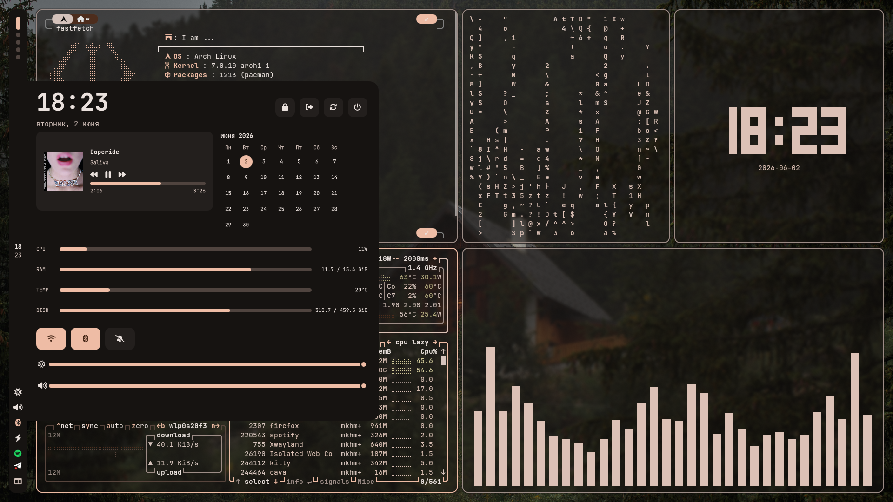

# Hyprland Rice

This repository stores the current version of my Linux desktop dotfiles from `~/.config`.

## Included Configs

- `btop`
- `cava`
- `eww`
- `fastfetch`
- `hypr`
- `kitty`
- `mako`
- `matugen`
- `nvim`
- `rofi`
- `screen`
- `wallpapers`
- `waybar`
- `wofi`

## Dependencies

- [Hyprland](https://github.com/hyprwm/Hyprland)
- [Kitty](https://sw.kovidgoyal.net/kitty/)
- [Wofi](https://hg.sr.ht/~scoopta/wofi)
- [Waybar](https://github.com/Alexays/Waybar)
- [Mako](https://github.com/emersion/mako)
- [Pywal16](https://github.com/adi1090x/pywal16)
- [Matugen](https://github.com/InioX/matugen)

## Screenshot



## Installation

1. Clone the repository:
   ```bash
   git clone https://github.com/mkhmtolzhas/mkhmtdots
   cd mkhmtdots
   ```
2. Install the required packages:
   ```bash
   sudo pacman -S hyprland kitty wofi waybar mako btop cava fastfetch rofi
   yay -S python-pywal16 matugen-bin
   ```
3. Run the installer:
   ```bash
   chmod +x install.sh
   ./install.sh
   ```

### Installer Options

```bash
./install.sh --no-backup
./install.sh --no-p10k
./install.sh --delete
```

## Notes

- `waybar` and `wofi` import colors from `~/.cache/wal/colors-waybar.css`.
- `install.sh` installs only directories tracked in this repository and optionally backs up existing files to `~/.config-backups/`.
